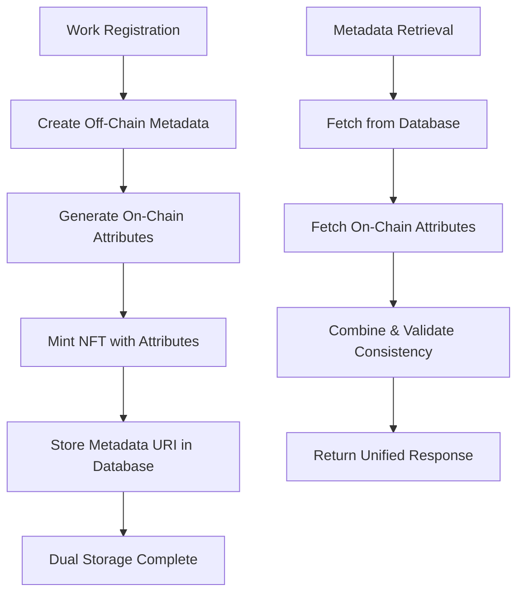

# Dual Storage Implementation: On-Chain + Off-Chain NFT Metadata

## Overview

This document outlines the implementation of dual storage for NFT metadata in the IP OnChain platform. We now store metadata both on-chain (using Metaplex Core attributes) and off-chain (in Supabase database), ensuring data redundancy, accessibility, and compliance with NFT standards.

## Architecture

### Storage Methods

#### 1. On-Chain Storage (Metaplex Core Attributes)

- **Technology**: Metaplex Core NFT with Attributes Plugin
- **Data Format**: Key-value pairs stored directly on Solana blockchain
- **Benefits**: Immutable, decentralized, always accessible
- **Limitations**: Storage costs, limited data size, string-only values

#### 2. Off-Chain Storage (Supabase Database)

- **Technology**: PostgreSQL database via Supabase
- **Data Format**: Structured relational data with full metadata
- **Benefits**: Rich queries, complex data types, cost-effective
- **Limitations**: Centralized, requires database availability

### Data Flow



## Implementation Details

### 1. On-Chain Attributes Structure

```typescript
interface OnChainAttribute {
  key: string
  value: string // All values stored as strings on-chain
}

// Example attributes stored on-chain:
const onChainAttributes = [
  { key: 'title', value: 'My Song Title' },
  { key: 'isrc', value: 'USUM71234567' },
  { key: 'total_shares', value: '100' },
  { key: 'contributors_count', value: '3' },
  { key: 'primary_artist', value: 'Artist Name' },
  { key: 'created_at', value: '2024-01-01T00:00:00Z' },
]
```

### 2. Off-Chain Metadata Structure

```typescript
interface OffChainMetadata {
  name: string
  description: string
  image: string
  external_url: string
  attributes: Array<{
    trait_type: string
    value: string | number
  }>
  properties: {
    category: string
    files: unknown[]
    creators: Array<{
      address: string
      share: number
      name: string
    }>
    ip_data: {
      isrc: string
      work_id: string
      total_shares: number
      registration_date: string
    }
  }
}
```

### 3. Database Schema Updates

```sql
-- Works table now includes metadata tracking
ALTER TABLE works ADD COLUMN IF NOT EXISTS metadata_uri TEXT;
ALTER TABLE works ADD COLUMN IF NOT EXISTS nft_mint_address TEXT;

-- Ensure we can track both storage methods
CREATE INDEX IF NOT EXISTS idx_works_nft_mint ON works(nft_mint_address);
CREATE INDEX IF NOT EXISTS idx_works_metadata_uri ON works(metadata_uri);
```

## Code Implementation

### 1. On-Chain Attribute Creation

```typescript
// src/lib/solana-server.ts
export function createOnChainAttributes(work: Work, contributors: Contributor[]): Attribute[] {
  return [
    { key: 'title', value: work.title },
    { key: 'isrc', value: work.isrc || 'Not specified' },
    { key: 'total_shares', value: work.total_shares?.toString() || '0' },
    { key: 'contributors_count', value: contributors.length.toString() },
    { key: 'primary_artist', value: contributors[0]?.name || 'Unknown' },
    { key: 'created_at', value: work.created_at || new Date().toISOString() },
  ]
}
```

### 2. NFT Minting with Attributes

```typescript
// Enhanced minting function with on-chain attributes
export async function mintWorkNFT(params: MintWorkNFTParams): Promise<MintResult> {
  const umi = createUmi(SOLANA_RPC_URL).use(mplCore())
  const asset = generateSigner(umi)

  // Create on-chain attributes
  const onChainAttributes = createOnChainAttributes(work, contributors)

  // Mint NFT with attributes plugin
  const createInstruction = createV1(umi, {
    asset,
    name: params.metadata.name,
    uri: params.metadata.uri,
    owner: toUmiPublicKey(params.ownerAddress),
    plugins: [
      pluginAuthorityPair({
        type: 'Attributes',
        data: {
          attributeList: onChainAttributes,
        },
      }),
    ],
  })

  await createInstruction.sendAndConfirm(umi)
  return { assetId: asset.publicKey }
}
```

### 3. Metadata API Enhancement

```typescript
// src/app/api/metadata/[workId]/route.ts
export async function GET(request: NextRequest, { params }: { params: { workId: string } }) {
  try {
    // Fetch off-chain data
    const work = await WorkRepository.findById(params.workId)
    const contributors = await ContributorRepository.findByWorkId(params.workId)

    // Fetch on-chain attributes if NFT exists
    let onChainAttributes: OnChainAttribute[] = []
    if (work?.nft_mint_address) {
      try {
        onChainAttributes = await getAssetAttributes(work.nft_mint_address)
      } catch (error) {
        console.warn('Failed to fetch on-chain attributes:', error)
      }
    }

    // Create unified response
    const response: MetadataResponse = {
      version: '1.0',
      type: 'metadata',
      workId: params.workId,
      timestamp: new Date().toISOString(),
      metadata: createWorkMetadata(work, contributors),
      database_fields: work, // Expose raw database data
      on_chain_attributes: onChainAttributes, // Expose on-chain data
    }

    return NextResponse.json(response)
  } catch (error) {
    return NextResponse.json({ error: 'Work not found' }, { status: 404 })
  }
}
```

### 4. On-Chain Attribute Retrieval

```typescript
// Function to fetch on-chain attributes
export async function getAssetAttributes(assetAddress: string): Promise<OnChainAttribute[]> {
  try {
    const umi = createUmi(SOLANA_RPC_URL).use(mplCore())
    const asset = await fetchAsset(umi, assetAddress)

    const attributesPlugin = asset.plugins?.find((plugin) => plugin.type === 'Attributes')
    if (attributesPlugin?.data?.attributeList) {
      return attributesPlugin.data.attributeList
    }

    return []
  } catch (error) {
    console.error('Error fetching on-chain attributes:', error)
    return []
  }
}
```

## Benefits of Dual Storage

### 1. Data Redundancy

- **Backup**: If one storage method fails, data remains accessible
- **Verification**: Cross-reference data between storage methods
- **Recovery**: Restore missing data from alternative storage

### 2. Performance Optimization

- **Fast Queries**: Database queries for complex filtering and searching
- **Blockchain Verification**: On-chain data for immutable proof
- **Hybrid Approaches**: Use appropriate storage for each use case

### 3. Compliance & Standards

- **NFT Standards**: Off-chain metadata follows OpenSea/Metaplex standards
- **Blockchain Native**: On-chain attributes for Web3 compatibility
- **API Flexibility**: Serve data in multiple formats as needed

### 4. Cost Efficiency

- **Reduced On-Chain Costs**: Store only essential data on-chain
- **Rich Off-Chain Data**: Store detailed metadata off-chain
- **Optimized Storage**: Use each method for its strengths

## Data Consistency Validation

### 1. Automatic Consistency Checks

```typescript
// Validate consistency between storage methods
function validateConsistency(offChainMetadata: any, onChainAttributes: OnChainAttribute[]): boolean {
  const checks = [
    {
      offChain: offChainMetadata.name,
      onChain: onChainAttributes.find((attr) => attr.key === 'title')?.value,
    },
    {
      offChain: offChainMetadata.properties.ip_data.isrc,
      onChain: onChainAttributes.find((attr) => attr.key === 'isrc')?.value,
    },
    {
      offChain: offChainMetadata.properties.ip_data.total_shares.toString(),
      onChain: onChainAttributes.find((attr) => attr.key === 'total_shares')?.value,
    },
  ]

  return checks.every((check) => check.offChain === check.onChain)
}
```

### 2. Monitoring & Alerting

```typescript
// Log inconsistencies for monitoring
if (!validateConsistency(offChainMetadata, onChainAttributes)) {
  console.warn('Data inconsistency detected', {
    workId: params.workId,
    offChain: offChainMetadata,
    onChain: onChainAttributes,
  })

  // Could trigger alerts in production
  // await sendAlert('data-inconsistency', { workId, details })
}
```

## Error Handling

### 1. Graceful Degradation

```typescript
// Handle partial failures gracefully
try {
  onChainAttributes = await getAssetAttributes(work.nft_mint_address)
} catch (error) {
  console.warn('On-chain fetch failed, using off-chain data only:', error)
  onChainAttributes = [] // Continue with empty on-chain data
}
```

### 2. Retry Mechanisms

```typescript
// Retry on-chain operations with exponential backoff
async function retryOnChainOperation<T>(operation: () => Promise<T>, maxRetries: number = 3): Promise<T> {
  for (let attempt = 1; attempt <= maxRetries; attempt++) {
    try {
      return await operation()
    } catch (error) {
      if (attempt === maxRetries) throw error
      await new Promise((resolve) => setTimeout(resolve, Math.pow(2, attempt) * 1000))
    }
  }
  throw new Error('Max retries exceeded')
}
```

## Migration Strategy

### 1. Existing Works

- **Backfill**: Migrate existing works to dual storage
- **Gradual**: Process works in batches to avoid overwhelming system
- **Validation**: Verify data consistency after migration

### 2. New Works

- **Default**: All new works use dual storage by default
- **Fallback**: Graceful handling if one storage method fails
- **Monitoring**: Track success rates and performance

## Testing Strategy

### 1. Unit Tests

- Test attribute creation functions
- Test metadata formatting
- Test consistency validation
- Test error handling

### 2. Integration Tests

- Test complete dual storage workflow
- Test NFT minting with attributes
- Test metadata retrieval with both storage methods
- Test failure scenarios

### 3. Performance Tests

- Test metadata retrieval speed
- Test minting performance with attributes
- Test concurrent operations

## Monitoring & Maintenance

### 1. Metrics to Track

- **Storage Success Rates**: On-chain vs off-chain success rates
- **Consistency Rates**: Percentage of consistent data
- **Performance Metrics**: Response times for dual storage operations
- **Error Rates**: Frequency and types of failures

### 2. Regular Maintenance

- **Consistency Audits**: Periodic validation of data consistency
- **Performance Optimization**: Monitor and optimize slow operations
- **Error Analysis**: Review and address common failure patterns

### 3. Alerting

- **Data Inconsistencies**: Alert when data doesn't match between storage
- **High Error Rates**: Alert when failure rates exceed thresholds
- **Performance Degradation**: Alert on slow response times

## Future Enhancements

### 1. Advanced Consistency

- **Automatic Repair**: Automatically fix minor inconsistencies
- **Conflict Resolution**: Handle conflicting data between storage methods
- **Audit Logging**: Track all changes and consistency checks

### 2. Performance Optimization

- **Caching**: Cache frequently accessed metadata
- **Batch Operations**: Optimize bulk operations
- **CDN Integration**: Serve metadata from edge locations

### 3. Enhanced Monitoring

- **Real-time Dashboards**: Live monitoring of dual storage health
- **Predictive Alerts**: Predict and prevent issues before they occur
- **Automated Recovery**: Automatically recover from certain failure types

## Conclusion

The dual storage implementation provides a robust, scalable solution for NFT metadata storage that combines the benefits of both on-chain and off-chain storage methods. This approach ensures data availability, enables rich queries, maintains blockchain immutability, and provides a foundation for future enhancements.

The implementation is designed with reliability, performance, and maintainability in mind, with comprehensive error handling, monitoring, and testing strategies to ensure long-term success.
