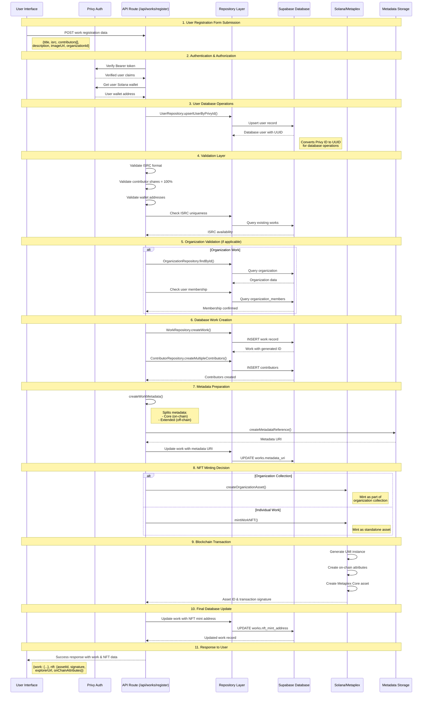

# IP OnChain - Register Work Flow Architecture

## Complete Register Work Flow Architecture

This diagram shows the end-to-end flow of registering intellectual property works as NFTs with hybrid on-chain/off-chain storage.



## Key Architecture Components

### 1. Hybrid Storage Strategy
- **On-Chain**: Core metadata (title, ISRC, contributors) via Metaplex Core Attributes Plugin
- **Off-Chain**: Extended metadata (description, images) via metadata URI pointing to API endpoint
- **Database**: Full work details, relationships, and caching for fast queries

### 2. Authentication Flow
- Privy JWT token verification in API routes
- Critical user ID conversion: `Privy ID (did:privy:...) → Database UUID`
- Organization membership validation for collaborative works

### 3. Data Validation Layers
- **Client-side**: React Hook Form with Zod schema validation
- **API-side**: ISRC format, contributor shares totaling 100%, wallet address validation
- **Database-side**: Foreign key constraints, unique indexes

### 4. NFT Minting Paths
- **Individual Works**: Direct Metaplex Core asset creation
- **Organization Works**: Asset creation within organization collection
- **Server-side Signing**: All transactions signed by server wallet for simplified UX

## Data Flow Highlights

### On-Chain Data (Stored in NFT Attributes)
```typescript
// Example on-chain attributes stored in Metaplex Core
{
  title: "Song Title",
  isrc: "USRC17607839",
  work_id: "uuid-work-id",
  contributors_count: "2",
  contributors_data: '[{"name":"Artist","wallet":"...","share":60}]',
  royalty_distribution: '[{"recipient":"...","share_percentage":60}]',
  type: "Intellectual Property",
  category: "Music"
}
```

### Off-Chain Data (Database + Metadata URI)
- Work relationships (organization_id, created_by_user_id)
- Extended metadata (descriptions, images, external URLs)
- Query optimization indexes for fast dashboard loading
- Audit trails and timestamps

## Error Handling Strategy

1. **Graceful Degradation**: Work is saved to database even if NFT minting fails
2. **Retry Capability**: Users can retry NFT minting for saved works
3. **Transaction Atomicity**: Database operations are wrapped in transactions
4. **User Feedback**: Clear error messages with actionable steps

## Security Considerations

- Server wallet private key secured via environment variables
- All database operations use parameterized queries
- Organization membership verified before allowing work registration
- ISRC uniqueness enforced at database level