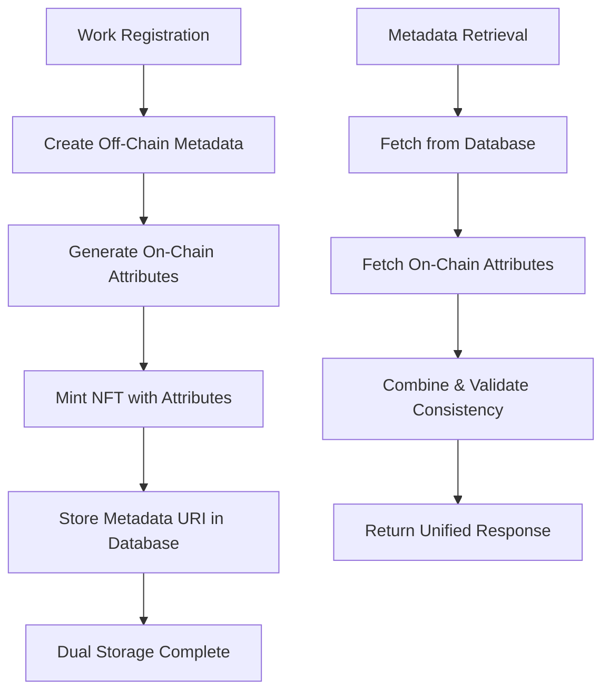
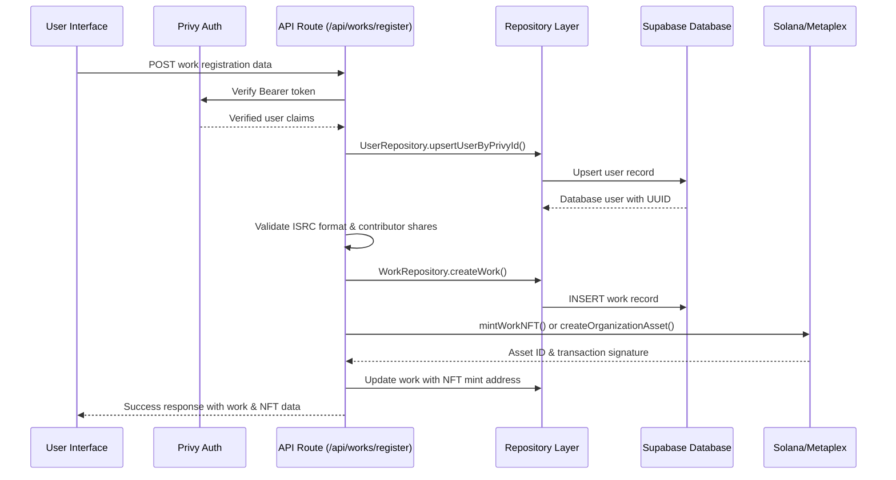

# IP OnChain Platform - Technical Specification

## Table of Contents

1. [System Architecture Overview](#system-architecture-overview)
2. [Authentication & User Management](#authentication--user-management)
3. [Hybrid Storage Architecture](#hybrid-storage-architecture)
4. [Database Schema & Integration](#database-schema--integration)
5. [Core Features](#core-features)
   - [Organization Management](#organization-management)
   - [Work Registration](#work-registration)
   - [Royalty System](#royalty-system)
6. [Testing Strategy](#testing-strategy)
7. [API Specifications](#api-specifications)
8. [Deployment & Configuration](#deployment--configuration)

---

## System Architecture Overview

IP OnChain is a Next.js application for intellectual property management on Solana blockchain. It enables users to register musical works and other IP as NFTs, manage organizations (publishing companies/artist collectives), and distribute royalties. The architecture combines on-chain storage using Metaplex Core with off-chain Supabase database for optimal performance.

### Core Technology Stack

- **Frontend**: Next.js 15 with TypeScript and Tailwind CSS
- **Blockchain**: Solana with Metaplex Core NFT standard
- **Database**: Supabase PostgreSQL for off-chain data and caching
- **Authentication**: Privy for seamless wallet integration
- **Testing**: Vitest with comprehensive test coverage

### Key Architectural Principles

- **Hybrid Storage**: Combines on-chain immutability with off-chain performance
- **Server-Side Wallet Management**: Eliminates complex key management for users
- **Dual-Write Operations**: Ensures data consistency between storage layers
- **Role-Based Access Control**: Secure organization and work management

---

## Authentication & User Management

### Privy Integration Architecture

The platform uses Privy for user authentication and wallet management, with wallet provisioning handled automatically by Privy's dashboard settings.

#### Authentication Components

**1. Client-Side Hooks** (`src/components/privy/use-privy-auth.tsx`)

```typescript
const {
  ready,           // Privy initialization status
  authenticated,   // User authentication status
  user,           // User object
  getAccessToken, // JWT token for API calls
  userEmail,      // User's email address
  userId,         // User's unique ID
} = usePrivyAuth()
```

**2. Authentication Guard** (`src/components/privy/auth-guard.tsx`)

```typescript
<AuthGuard>
  <YourProtectedComponent />
</AuthGuard>
```

**3. Server-Side Utilities** (`src/lib/privy-server.ts`)

- `verifyPrivyToken(accessToken)` - Verifies JWT tokens from client
- `getPrivyUser(userId)` - Retrieves user data from Privy
- `getUserSolanaWallet(user)` - Extracts Solana wallet from user data
- `getUserSolanaWalletFromPrivy(userId)` - Gets user's wallet by ID

#### Critical User ID Conversion Pattern

The application uses a critical conversion pattern between Privy user IDs (`did:privy:...`) and database UUIDs:

```typescript
// All repository methods must convert Privy IDs to database IDs
const user = await UserRepository.findByPrivyUserId(privyUserId)
if (!user) return [] // Handle gracefully
// Use user.id (UUID) for database operations, not privyUserId
```

#### Authentication Flow

1. **User Registration/Login**
   - User visits protected route
   - AuthGuard redirects to `/auth/login` if not authenticated
   - User completes Privy authentication flow
   - Wallet automatically provisioned by Privy (if enabled)
   - User redirected to original destination

2. **API Authentication**
   - Client calls `getAccessToken()` from usePrivyAuth hook
   - JWT token passed in Authorization header
   - Server verifies token using `verifyPrivyToken()`
   - API operations proceed with verified user context

#### Server-Side Token Verification

```typescript
import { verifyPrivyToken } from '@/lib/privy-server'

export async function POST(request: NextRequest) {
  const authHeader = request.headers.get('authorization')
  const accessToken = authHeader?.replace('Bearer ', '')

  const verifiedClaims = await verifyPrivyToken(accessToken)
  if (!verifiedClaims) {
    return NextResponse.json({ error: 'Unauthorized' }, { status: 401 })
  }

  const userId = verifiedClaims.userId
}
```

---

## Hybrid Storage Architecture

### Dual Storage Implementation

The platform implements dual storage for NFT metadata, storing data both on-chain (using Metaplex Core attributes) and off-chain (in Supabase database) for optimal performance and data redundancy.

#### Storage Methods

**1. On-Chain Storage (Metaplex Core Attributes)**
- **Technology**: Metaplex Core NFT with Attributes Plugin
- **Data Format**: Key-value pairs stored directly on Solana blockchain
- **Benefits**: Immutable, decentralized, always accessible
- **Limitations**: Storage costs, limited data size, string-only values

**2. Off-Chain Storage (Supabase Database)**
- **Technology**: PostgreSQL database via Supabase
- **Data Format**: Structured relational data with full metadata
- **Benefits**: Rich queries, complex data types, cost-effective
- **Limitations**: Centralized, requires database availability

### Data Flow Architecture



#### On-Chain Attributes Structure

```typescript
interface OnChainAttribute {
  key: string
  value: string // All values stored as strings on-chain
}

// Example attributes stored on-chain:
const onChainAttributes = [
  { key: 'title', value: 'My Song Title' },
  { key: 'isrc', value: 'USUM71234567' },
  { key: 'total_shares', value: '100' },
  { key: 'contributors_count', value: '3' },
  { key: 'primary_artist', value: 'Artist Name' },
  { key: 'created_at', value: '2024-01-01T00:00:00Z' },
]
```

#### Off-Chain Metadata Structure

```typescript
interface OffChainMetadata {
  name: string
  description: string
  image: string
  external_url: string
  attributes: Array<{
    trait_type: string
    value: string | number
  }>
  properties: {
    category: string
    files: unknown[]
    creators: Array<{
      address: string
      share: number
      name: string
    }>
    ip_data: {
      isrc: string
      work_id: string
      total_shares: number
      registration_date: string
    }
  }
}
```

### Solana/Metaplex Integration

#### UMI Instance Configuration

```typescript
// Located in: src/lib/solana-server.ts
export function createUmiInstance(): Umi {
  const umi = createUmi(SOLANA_RPC_URL).use(mplCore())
  
  if (SERVER_KEYPAIR) {
    const umiKeypair = fromWeb3JsKeypair(SERVER_KEYPAIR)
    umi.use(keypairIdentity(umiKeypair))
  }
  
  return umi
}
```

#### NFT Minting with Attributes

```typescript
export async function mintWorkNFT(params: MintWorkNFTParams): Promise<MintResult> {
  const umi = createUmi(SOLANA_RPC_URL).use(mplCore())
  const asset = generateSigner(umi)

  // Create on-chain attributes
  const onChainAttributes = createOnChainAttributes(work, contributors)

  // Mint NFT with attributes plugin
  const createInstruction = createV1(umi, {
    asset,
    name: params.metadata.name,
    uri: params.metadata.uri,
    owner: toUmiPublicKey(params.ownerAddress),
    plugins: [
      pluginAuthorityPair({
        type: 'Attributes',
        data: {
          attributeList: onChainAttributes,
        },
      }),
    ],
  })

  await createInstruction.sendAndConfirm(umi)
  return { assetId: asset.publicKey }
}
```

#### Data Consistency Validation

```typescript
// Validate consistency between storage methods
function validateConsistency(offChainMetadata: any, onChainAttributes: OnChainAttribute[]): boolean {
  const checks = [
    {
      offChain: offChainMetadata.name,
      onChain: onChainAttributes.find((attr) => attr.key === 'title')?.value,
    },
    {
      offChain: offChainMetadata.properties.ip_data.isrc,
      onChain: onChainAttributes.find((attr) => attr.key === 'isrc')?.value,
    },
    {
      offChain: offChainMetadata.properties.ip_data.total_shares.toString(),
      onChain: onChainAttributes.find((attr) => attr.key === 'total_shares')?.value,
    },
  ]

  return checks.every((check) => check.offChain === check.onChain)
}
```

---

## Database Schema & Integration

### Supabase Integration

The platform uses Supabase as the off-chain data storage solution, providing a robust PostgreSQL database foundation while maintaining on-chain operations for NFT minting and royalty distribution.

#### Database Tables

**Users Table**
```sql
CREATE TABLE users (
  id UUID PRIMARY KEY DEFAULT uuid_generate_v4(),
  privy_user_id VARCHAR UNIQUE NOT NULL,
  email VARCHAR,
  embedded_wallet_address VARCHAR,
  created_at TIMESTAMP WITH TIME ZONE DEFAULT NOW()
);
```

**Works Table**
```sql
CREATE TABLE works (
  id UUID PRIMARY KEY DEFAULT uuid_generate_v4(),
  title VARCHAR NOT NULL,
  isrc VARCHAR UNIQUE,
  total_shares INTEGER DEFAULT 100,
  nft_mint_address VARCHAR,
  metadata_uri TEXT,
  organization_id UUID REFERENCES organizations(id),
  created_by_user_id UUID REFERENCES users(id),
  created_at TIMESTAMP WITH TIME ZONE DEFAULT NOW(),
  updated_at TIMESTAMP WITH TIME ZONE DEFAULT NOW()
);
```

**Organizations Table**
```sql
CREATE TABLE organizations (
  id UUID PRIMARY KEY DEFAULT uuid_generate_v4(),
  name VARCHAR NOT NULL,
  collection_address VARCHAR UNIQUE,
  created_at TIMESTAMP WITH TIME ZONE DEFAULT NOW(),
  updated_at TIMESTAMP WITH TIME ZONE DEFAULT NOW()
);
```

**Organization Members Table**
```sql
CREATE TABLE organization_members (
  id UUID PRIMARY KEY DEFAULT uuid_generate_v4(),
  organization_id UUID NOT NULL REFERENCES organizations(id) ON DELETE CASCADE,
  user_id UUID NOT NULL REFERENCES users(id) ON DELETE CASCADE,
  role VARCHAR CHECK (role IN ('owner', 'admin', 'member')),
  created_at TIMESTAMP WITH TIME ZONE DEFAULT NOW(),
  UNIQUE(organization_id, user_id)
);
```

**Contributors Table**
```sql
CREATE TABLE contributors (
  id UUID PRIMARY KEY DEFAULT uuid_generate_v4(),
  work_id UUID REFERENCES works(id) ON DELETE CASCADE,
  name VARCHAR NOT NULL,
  wallet_address VARCHAR NOT NULL,
  royalty_share INTEGER NOT NULL CHECK (royalty_share >= 0 AND royalty_share <= 100),
  created_at TIMESTAMP WITH TIME ZONE DEFAULT NOW()
);
```

**Usage Events Table**
```sql
CREATE TABLE usage_events (
  id UUID PRIMARY KEY DEFAULT uuid_generate_v4(),
  work_id UUID REFERENCES works(id),
  event_type VARCHAR CHECK (event_type IN ('stream', 'download', 'radio', 'sync')),
  platform VARCHAR,
  play_count INTEGER,
  unit_count INTEGER,
  revenue_amount DECIMAL(10,4),
  period_start TIMESTAMP,
  period_end TIMESTAMP,
  reported_at TIMESTAMP WITH TIME ZONE DEFAULT NOW()
);
```

**Royalty Earnings Table**
```sql
CREATE TABLE royalty_earnings (
  id UUID PRIMARY KEY DEFAULT uuid_generate_v4(),
  work_id UUID UNIQUE REFERENCES works(id),
  total_earnings DECIMAL(10,4),
  performance_earnings DECIMAL(10,4),
  mechanical_earnings DECIMAL(10,4),
  sync_earnings DECIMAL(10,4),
  last_calculated_at TIMESTAMP WITH TIME ZONE DEFAULT NOW()
);
```

#### Repository Layer Structure

Located in `src/lib/repositories/`, each repository follows consistent patterns:

**UserRepository**
- Manages Privy user ID to database UUID mapping
- Handles user upserts during authentication
- Critical for all user-related operations across the application

**OrganizationRepository**
- Handles user ID conversion from Privy to database UUIDs
- Manages role-based permissions (owner/admin/member)
- Creates on-chain collections via Metaplex Core
- Critical methods: `findUserOrganizations()`, `isMember()`, `hasPermission()`

**WorkRepository**
- Manages IP work registration with contributors
- Links works to organizations when applicable
- Handles ISRC validation and uniqueness
- Updates NFT mint addresses after on-chain creation

**ContributorRepository**
- Contributor management per work
- Royalty share validation (must total 100%)
- Bulk contributor creation

---

## Core Features

### Organization Management

#### Overview

The Organization Feature enables multi-user collaboration for intellectual property management. Organizations can represent publishing companies, record labels, artist collectives, or any entity that manages IP works collectively.

#### Hybrid On-Chain/Off-Chain Design

- **On-Chain**: Metaplex Core Collections with Attributes Plugin for membership and metadata
- **Off-Chain**: Supabase database for fast queries and caching
- **Synchronization**: Dual-write operations ensure data consistency

#### On-Chain Structure

Each organization creates a Metaplex Core Collection with the following attributes:

```typescript
{
  "org_type": "publishing_company" | "individual_artist",
  "org_name": "Organization Name",
  "owner_id": "privy_user_id",
  "created_at": "timestamp",
  "member_[userId]_role": "owner" | "admin" | "member",
  "member_[userId]_joined": "timestamp",
  "member_[userId]_name": "display_name"
}
```

#### Permission System

- **Owner**: Full control, can add/remove members, delete organization
- **Admin**: Can add/remove members, register works
- **Member**: Can register works under the organization

#### API Endpoints

- `GET /api/organizations` - Lists all organizations for authenticated user
- `POST /api/organizations` - Creates new organization with on-chain collection
- `GET /api/organizations/[id]` - Retrieves organization details with collection data
- `POST /api/organizations/[id]/members` - Adds new member (requires admin/owner permissions)

### Work Registration

#### Architecture Overview

The work registration system handles end-to-end registration of intellectual property works as NFTs with hybrid on-chain/off-chain storage.

#### Complete Registration Flow



#### Validation Layers

- **Client-side**: React Hook Form with Zod schema validation
- **API-side**: ISRC format, contributor shares totaling 100%, wallet address validation
- **Database-side**: Foreign key constraints, unique indexes

#### NFT Minting Paths

- **Individual Works**: Direct Metaplex Core asset creation
- **Organization Works**: Asset creation within organization collection
- **Server-side Signing**: All transactions signed by server wallet for simplified UX

### Royalty System

#### Overview

The royalty system simulates real-world music industry revenue streams by tracking usage events from different platforms and calculating earnings based on industry-standard rates.

#### Revenue Stream Categories

**1. Performance Royalties (60% of events)**
- **Sources**: Streaming platforms, radio stations
- **Streaming**: Spotify, Apple Music, YouTube Music, Tidal, Deezer
- **Radio**: FM radio, internet radio, satellite radio
- **Revenue Rates**: Streaming: $0.001-$0.003 per stream, Radio: $0.01-$0.03 per play

**2. Mechanical Royalties (20% of events)**
- **Sources**: Digital downloads, physical sales
- **Platforms**: iTunes, Amazon Music, Bandcamp, Beatport
- **Revenue Rates**: Downloads: $0.50-$1.00 per unit

**3. Synchronization Royalties (5% of events)**
- **Sources**: Commercial usage in media
- **Types**: TV commercials, film soundtracks, YouTube content, podcasts
- **Revenue Rates**: Sync deals: $50-$250 per placement

#### Calculation Engine

```typescript
// Earnings formula for each work
const earnings = {
  performance: sum(streams + radio_plays) * respective_rates,
  mechanical: sum(downloads) * download_rates,
  sync: sum(sync_deals) * sync_rates,
  total: performance + mechanical + sync
}

// Per contributor
const contributorEarnings = (totalEarnings * contributorShare) / 100
```

#### Mock Data Simulation

The mock data generator simulates realistic usage reporting with:
- **Time Period**: 30 days of historical data
- **Event Frequency**: ~8 events per day per work
- **Platform Distribution**: Weighted realistic distribution
- **Revenue Rates**: Industry-standard rates per platform type

---

## Testing Strategy

### Overview

The testing strategy focuses on testing critical functionality without aiming for 100% coverage, ensuring the most important parts of the application work correctly.

### Technology Stack

- **Test Runner**: Vitest (faster than Jest, better TypeScript support)
- **Testing Library**: @testing-library/react for component tests
- **Mocking**: Vitest's built-in mocking capabilities
- **Environment**: jsdom for DOM simulation

### Test Categories

#### 1. Unit Tests

**Location**: `src/lib/__tests__/`

**Utility Functions** (`utils.test.ts`):
- **validateISRC**: Comprehensive ISRC format validation with edge cases
- **validateRoyaltyShares**: Ensures contributor shares total exactly 100%
- **validateWalletAddress**: Solana wallet address validation with security checks
- **Security Testing**: Malicious input validation (XSS, SQL injection, unicode)

**Repository Layer**:
- **WorkRepository**: Work creation, ISRC uniqueness, NFT mint address updates
- **ContributorRepository**: Multiple contributor creation, royalty share validation
- **OrganizationRepository**: User ID conversion, role-based permissions

#### 2. Integration Tests

**API Client** (`api-client.test.ts`):
- Tests the real ApiClient class from `src/lib/api-client.ts`
- Constructor behavior, authentication, work registration, error handling

**Workflow Integration** (`integration.test.ts`):
- Cross-component workflows
- Work registration workflow
- Royalty distribution workflow
- Data validation pipeline

#### 3. Organization Feature Testing

**Repository Layer Tests**:
```typescript
describe('OrganizationRepository', () => {
  it('should convert Privy user IDs to database UUIDs')
  it('should handle user not found scenarios gracefully')
  it('should enforce role-based permissions')
  it('should prevent duplicate memberships')
})
```

**API Endpoint Tests**:
```typescript
describe('/api/organizations', () => {
  it('should require authentication for all operations')
  it('should validate organization creation data')
  it('should create on-chain collections during organization creation')
  it('should handle permission checks for member management')
})
```

#### 4. Dual Storage Testing

**On-Chain Attribute Tests**:
```typescript
describe('createOnChainAttributes', () => {
  it('should create proper attributes from work and contributors')
  it('should handle missing ISRC gracefully')
  it('should convert numeric values to strings for on-chain storage')
})
```

**Consistency Tests**:
```typescript
describe('Dual Storage Consistency', () => {
  it('should maintain data consistency between on-chain and off-chain')
  it('should handle partial failures gracefully')
  it('should validate metadata schema compliance')
})
```

### Mock Strategy

**Global Mocks** (`src/test/setup.ts`):
- Next.js Router navigation mocking
- Privy Authentication user state
- Supabase Client database operations
- Environment Variables test configuration

**Test-Specific Mocks**:
- HTTP Requests: Fetch API mocking for API client tests
- External Services: IPFS, blockchain interactions
- Database Responses: Controlled test data scenarios

### Current Test Results

```bash
✅ Total Test Files: 14 passed
✅ Total Tests: 152 passed

Breakdown:
✅ Utility Functions: 19/19 passing
✅ API Client (Real Class): 12/12 passing
✅ Integration Workflows: 6/6 passing
✅ Repository Tests: 41/41 passing
✅ Route Validation: 21/21 passing
✅ Organization Integration: 7/7 passing
✅ Property-based Tests: 14/14 passing

Overall Success Rate: 100% (152/152)
```

---

## API Specifications

### Authentication Flow

All protected API routes follow this pattern:
1. Extract Bearer token from Authorization header
2. Verify with Privy server using `privyServer.verifyAuthToken()`
3. Convert Privy user ID to database user with `UserRepository.findByPrivyUserId()`
4. Proceed with business logic

### Organization Permission Checks

```typescript
// Check organization membership
const isMember = await OrganizationRepository.isMember(orgId, privyUserId)

// Check specific permissions
const hasPermission = await OrganizationRepository.hasPermission(
  orgId, 
  privyUserId, 
  ['owner', 'admin']
)
```

### Key API Endpoints

#### Work Management
- `POST /api/works/register` - Register new IP work with contributors
- `GET /api/works/list` - List all works for authenticated user
- `GET /api/works/[id]` - Get specific work details
- `GET /api/metadata/[workId]` - Get NFT metadata with dual storage

#### Organization Management
- `GET /api/organizations` - List user's organizations
- `POST /api/organizations` - Create new organization
- `GET /api/organizations/[id]` - Get organization details
- `POST /api/organizations/[id]/members` - Add organization member

#### Royalty Management
- `POST /api/royalties/calculate` - Calculate royalties for works
- `POST /api/royalties/distribute` - Distribute royalties to contributors
- `GET /api/royalties/earnings` - Get earnings data
- `POST /api/usage-events` - Record usage events
- `POST /api/mock-usage` - Generate mock usage data

---

## Deployment & Configuration

### Environment Configuration

#### Required Environment Variables

```bash
# Supabase
NEXT_PUBLIC_SUPABASE_URL=
NEXT_PUBLIC_SUPABASE_ANON_KEY=
SUPABASE_SERVICE_ROLE_KEY=

# Privy Authentication  
NEXT_PUBLIC_PRIVY_APP_ID=
NEXT_PRIVATE_PRIVY_APP_SECRET=

# Solana
SERVER_WALLET_PRIVATE_KEY=
SOLANA_RPC_URL=
NEXT_PUBLIC_SOLANA_RPC_URL=

# Application Configuration
NEXT_PUBLIC_APP_URL=
```

### Solana Integration

#### Metaplex Core Operations
- **Collections**: Represent organizations with attributes for membership
- **Assets**: Individual IP works, optionally part of organization collections
- **Attributes Plugin**: Stores metadata on-chain for both collections and assets

#### Server Wallet Management
- All on-chain operations use server-managed wallet (`SERVER_WALLET_PRIVATE_KEY`)
- Eliminates complex key management for users
- Membership tracked via collection attributes rather than separate accounts

### Common Debugging Patterns

#### User ID Issues
If seeing "invalid input syntax for type uuid" errors:
- Check that Privy user ID conversion is happening in repository methods
- Ensure `UserRepository.findByPrivyUserId()` is called before database operations
- Verify user exists in database before organization operations

#### Organization Permission Issues
- Use `OrganizationRepository.hasPermission()` for admin/owner checks
- Check organization membership with `isMember()` before work registration
- Ensure proper role validation in API endpoints

#### Test Failures
- Organization tests require proper user ID mocking patterns
- Supabase mock chaining must return correct objects for method chaining
- Use OrganizationBuilder with explicit null handling for collection addresses

### Performance Considerations

#### Transaction Costs
- **Asset Creation**: ~0.001-0.01 SOL per NFT
- **Attribute Storage**: Minimal additional cost
- **Collection Assets**: Similar to individual assets

#### Network Efficiency
- **Batch Operations**: Multiple attributes in single transaction
- **Optimized RPC**: Configured for devnet/mainnet
- **Confirmation Strategy**: 'confirmed' commitment level

#### Caching Strategy
- **Database Mirrors**: Full work data cached off-chain
- **API Endpoints**: Fast metadata retrieval
- **Asset Queries**: Cached collection membership

---

## Documentation References

For detailed implementation specifics, see the archived documentation:

- `/docs/archive/AUTHENTICATION_FLOW.md` - Privy integration patterns
- `/docs/archive/DUAL_STORAGE_IMPLEMENTATION.md` - Hybrid storage architecture
- `/docs/archive/ORGANIZATION_FEATURE.md` - Complete organization implementation
- `/docs/archive/REGISTER_WORK_ARCHITECTURE.md` - Work registration flow details
- `/docs/archive/ROYALTY_CALCULATION_SYSTEM.md` - Revenue calculation system
- `/docs/archive/SOLANA_METAPLEX_ARCHITECTURE.md` - Blockchain integration details
- `/docs/archive/SUPABASE_INTEGRATION.md` - Database integration specifics
- `/docs/archive/TESTING_STRATEGY.md` - Comprehensive testing approach

---

*This technical specification serves as the single source of truth for the IP OnChain platform architecture. All implementation decisions should align with the patterns and principles documented here.*