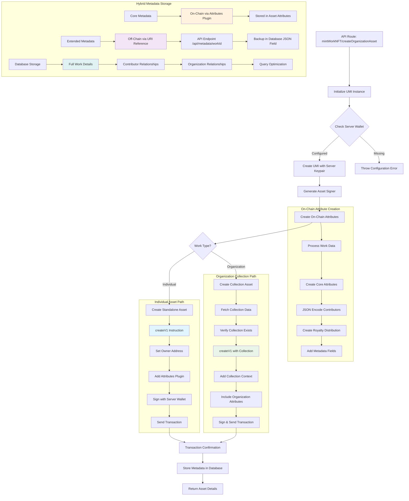
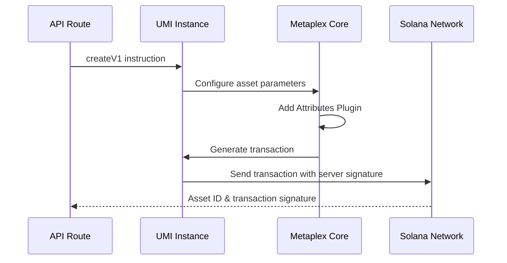
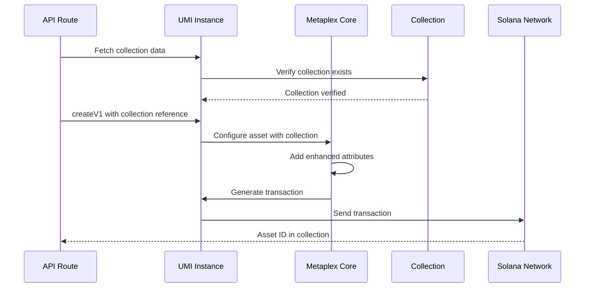
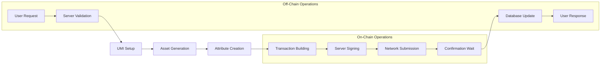

# Solana/Metaplex Integration Architecture

## NFT Minting & Blockchain Integration

This diagram details the Solana blockchain integration using Metaplex Core for NFT creation with hybrid metadata storage.



## Detailed Component Analysis

### 1. UMI Instance Configuration
```typescript
// Located in: src/lib/solana-server.ts:38-47
export function createUmiInstance(): Umi {
  const umi = createUmi(SOLANA_RPC_URL).use(mplCore())
  
  if (SERVER_KEYPAIR) {
    const umiKeypair = fromWeb3JsKeypair(SERVER_KEYPAIR)
    umi.use(keypairIdentity(umiKeypair))
  }
  
  return umi
}
```

### 2. On-Chain Attribute Structure
```typescript
// Located in: src/lib/solana-server.ts:52-97
export function createOnChainAttributes(workData: {
  title: string
  isrc?: string
  contributors: Array<{name: string, wallet: string, share: number}>
  workId: string
  description?: string
}): Attribute[] {
  return [
    { key: 'title', value: workData.title },
    { key: 'isrc', value: workData.isrc || 'Not specified' },
    { key: 'work_id', value: workData.workId },
    { key: 'contributors_count', value: workData.contributors.length.toString() },
    { key: 'total_shares', value: '100' },
    { key: 'type', value: 'Intellectual Property' },
    { key: 'category', value: 'Music' },
    { key: 'contributors_data', value: JSON.stringify(workData.contributors) },
    { key: 'royalty_distribution', value: JSON.stringify(/* royalty data */) }
  ]
}
```

### 3. NFT Creation Flows

#### Individual Asset Creation


#### Organization Collection Asset


## Hybrid Metadata Architecture

### On-Chain Storage (Metaplex Core Attributes)
**Advantages:**
- Permanent, immutable storage
- Direct blockchain verification
- No external dependencies
- Gas-efficient for core data

**Data Stored:**
- Work title and ISRC
- Contributor count and shares
- Work type and category
- Encoded contributor/royalty data

### Off-Chain Storage (API + Database)
**Advantages:**
- Large data capacity
- Fast query performance
- Updatable descriptions/images
- Complex relational data

**Data Stored:**
- Extended metadata (descriptions, images)
- Database relationships
- Caching and performance optimization
- Backup of on-chain data

## Transaction Flow Analysis



## Key Integration Points

### 1. Server Wallet Management
- **Security**: Private key stored in environment variables
- **Functionality**: Signs all transactions server-side
- **UX Benefit**: No user wallet interaction required
- **Location**: `src/lib/solana-server.ts:27-33`

### 2. Collection vs Asset Creation
- **Collections**: Represent organizations/publishers
- **Assets**: Individual IP works, optionally in collections
- **Membership**: Tracked via on-chain collection attributes
- **Location**: `src/lib/solana-server.ts:534-857`

### 3. Attribute Plugin Usage
- **Plugin Type**: Metaplex Core Attributes Plugin
- **Purpose**: Store structured metadata on-chain
- **Encoding**: JSON strings for complex data structures
- **Retrieval**: Direct blockchain queries or cached database

### 4. Error Handling & Recovery
- **Graceful Degradation**: Work saved even if minting fails
- **Retry Logic**: User can retry minting later
- **Database Backup**: Full metadata stored off-chain
- **Transaction Monitoring**: Confirmation waiting with timeouts

## Performance Considerations

### Transaction Costs
- **Asset Creation**: ~0.001-0.01 SOL per NFT
- **Attribute Storage**: Minimal additional cost
- **Collection Assets**: Similar to individual assets

### Network Efficiency
- **Batch Operations**: Multiple attributes in single transaction
- **Optimized RPC**: Configured for devnet/mainnet
- **Confirmation Strategy**: 'confirmed' commitment level

### Caching Strategy
- **Database Mirrors**: Full work data cached off-chain
- **API Endpoints**: Fast metadata retrieval
- **Asset Queries**: Cached collection membership